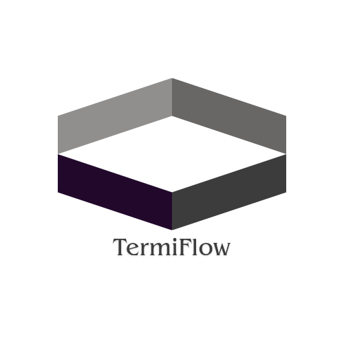

<div align = "center">



<a href = "LICENSE.md"></a>
<a href = "https://github.com/tecnolgd/TermiFlow/issues"></a>
<a href = "https://github.com/tecnolgd/TermiFlow/releases"></a>
<a href="https://github.com/tecnolgd/TermiFlow/graphs/contributors">
  
</a>
<a href = "#documentation"></a>
</div>

## What is TermiFlow?

> **TermiFlow** is a command-driven terminal tool that lets users **launch applications, execute shortcuts, track command history**, and **much more** — all from a single, fast, keyboard-centric interface.

Think of it as:
- a ***minimal launcher***
- a ***command hub***
- a ***foundation for terminal automation***

*No GUI. No fluff. Just flow.*

## Sample GIF


## Why TermiFlow?

Modern systems are powerful but fragmented.  
TermiFlow exists to answer one question:

> *“Why should I leave the terminal to do simple things?”*

It’s designed for:
- developers
- power users
- anyone who prefers speed over clicks

## Quick Run

### Prerequisites
- Linux/Windows OS with g++ (used version 13.0.0) compiler (with MinGW for Windows cross-compilation)
- Basic terminal/command-line knowledge
- `make` utility installed

### Build Instructions
```bash
git clone https://github.com/tecnolgd/termiflow.git
```
```bash
cd termiflow
```

#### Using Makefile (Recommended)

**For Linux:**
```bash
make build        # or simply: make
make run          # Build and run immediately
make rebuild      # Clean and rebuild
```

**For Windows (requires MinGW):**
```bash
mkdir build
make windows
```

**Other useful targets:**
```bash
make help         # Show all available targets
make clean        # Remove build artifacts
make info         # Display build information
```

#### Manual Build (Without Makefile)

**On Linux:**
```bash
g++ src/main.cpp src/core/*.cpp src/features/*.cpp -o termiflow -I./include
```

**On Windows (MinGW):**
```bash
x86_64-w64-mingw32-g++ src/main.cpp src/core/*.cpp src/features/*.cpp -o termiflow.exe -I./include -static -static-libgcc -static-libstdc++
```

## How to Run
After building, run the application:

```bash
./build/termiflow    # for Linux

./build/termiflow.exe   # for Windows
```

## Features Overview

| Feature | Description | Status |
|---------|-------------|--------|
| **Command Handler** | Central command parser and dispatcher | ✅ Implemented |
| **Application Launcher** | Launch system applications directly | ✅ Implemented |
| **Custom Shortcuts** | Define your own app launch shortcuts | ✅ Implemented (Currently for Windows apps) |
| **Theme Manager** | Light/Dark terminal themes | ✅ Implemented |
| **Command History** | Display previous commands | ✅ Implemented |
| **System Stats** | Display CPU, Memory, Uptime info | ✅ Implemented (Windows & linux) |
| **Configuration** | Auto-launch previously used theme as default theme | ✅ Implemented |


## Features Implemented (Current)

### Command Handler
- Central command parser and dispatcher
- Routes user input to appropriate modules
- Neatly handles unknown commands

### Application Launcher
- Launches system applications **directly** from the terminal
- **Platform-aware** execution logic (Windows/Linux)

### Custom Shortcuts
- Users can define their **own** shortcuts  
  Example:
  ```bash
  shortcuts add  chrome c
  ```
- (Note: Shortcuts are currently defined for Windows systems; Linux support comming soon!)

### Terminal theme management
- Provides *light* and *dark* theme for terminals
- Switch themes with a single command

### Command history 
- Stores every command typed in command-line mode.
- Displays commands up to the most recent command.

### System stats view
- Displays system stats like **CPU usage(N/A)**, **Memory usage** and **Uptime**
- Currently works for windows systems.

## How it works?
- TermiFlow is built around a **modular C++** core.    
- Each feature (launching, shortcuts, history, etc.) is implemented as a separate module, making it easy to extend and maintain.    
- The command handler parses user input and dispatches it to the appropriate module. Command history and themes are managed via simple text files.

## Troubleshooting

**Application won't start:**
- Ensure all dependencies (g++ compiler) are installed.
- Check file permissions: `chmod +x ./build/main`.
- Verify the build was successful.

**Shortcuts not working:**
- Verify shortcuts were saved correctly with `shortcuts list`.
- Re-add shortcuts if needed: `shortcuts add [app] [shortcut]`.

**System stats display:**
- Currently optimized for Windows systems with slight linux support(unstable).
- Cross-platform support coming soon.

## Documentation

- [**Architecture**](assets/docs/architecture.md)
- [**Commands Reference**](assets/docs/command_reference.md)
- [**Roadmap**](assets/docs/roadmap.md)

For more details, refer to:
- **Code comments** in source files for implementation details
- **Header files** in `include/` directory for function details

## License
[MIT License](LICENSE.md)

## Future Upgrades
- **Cross-platform** support (Linux, macOS)
- Plugin system for third-party modules
- Enhanced system stats (CPU, network, etc.)    
- **Scripting** and **automation** features 
- **Config Management** for tool customisation   
- **More** themes and customization options

## [Contributing](CONTRIBUTING.md)

## Contributors
A huge thanks to the developers contributing to TermiFlow.
- [@iamkyrin](https://github.com/iamkyrin)

## Support This Project

If TermiFlow has positively impacted your workflow, consider:
- Starring this repository
- Forking the project
- Sharing feedback and suggestions
- [Contributing](CONTRIBUTING.md) code or documentation

## Author & Version

- **Author:** tecnolgd  
- **Version:** v0.1.1-beta  
- **License:** [MIT License](LICENSE.md)